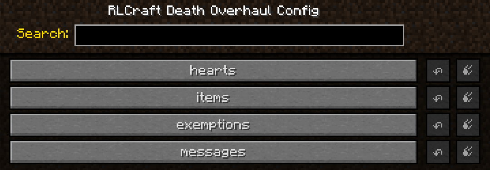
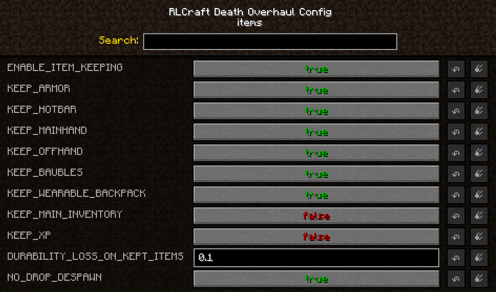

# RLCraft Death Overhaul

Forge 1.12.2 addon. Dying costs you hearts off your maximum health instead of your whole
inventory. Works out of the box — no config editing, no second mod to set up.

Requires [Scaling Health](https://www.curseforge.com/minecraft/mc-mods/scaling-health).
Built for RLCraft and RLCraft Dregora, but nothing in it is pack-specific.

## What happens when you die

| | |
|---|---|
| **Kept** | Armour, hotbar, mainhand, offhand, Baubles (which covers the Tool Belt), Wearable Backpack and its contents |
| **Dropped** | Your main inventory — the 27 non-hotbar slots |
| **Drops last 15 minutes** | Vanilla gives you 5. Configurable, `-1` for never |
| **Durability** | 10% off every damageable item you kept. Never breaks anything — stops at 1 durability |
| **Health** | One heart off your max, down to a minimum. Recovered only via heart containers |

## The health minimum

`MIN_HEARTS` defaults to `10`, matching Scaling Health's `Starting Health`. So the hearts
you start with can never be taken, and only hearts you added with heart containers are at
risk. Dying early costs nothing; spending a heart container becomes a decision.

If you change Scaling Health's `Starting Health`, change `MIN_HEARTS` to match.

## Grace period

`DEATHS_PER_PENALTY` sets how many deaths it takes to be charged. Default `1`. Set it to
`3` for two free deaths before the third takes a heart.

Scaling Health already has flat per-death health loss and a health minimum. The grace period
is the part it lacks — and the reason this mod exists rather than being a config change.

## Settings

`config/rlcraftdeathoverhaul.cfg`, or Mods → RLCraft Death Overhaul → Config. Health
values are in whole hearts. Everything is read live; nothing needs a restart.

Split into four categories: `hearts`, `items`, `exemptions`, `messages`.



**hearts** — what dying costs you in health

| Setting | Default | Effect |
|---|---|---|
| `HEARTS_LOST_PER_PENALTY` | `1.0` | Hearts per penalty. Accepts halves. `0` disables health loss |
| `DEATHS_PER_PENALTY` | `1` | Deaths needed to trigger a penalty |
| `MIN_HEARTS` | `10.0` | Lowest your max health can go |
| `RESET_COUNTER_ON_PENALTY` | `true` | Grace period repeats rather than being one-time |
| `RESET_COUNTER_ON_SLEEP` | `false` | Sleeping clears pending deaths. Does not refund hearts |

**items** — what survives, and what keeping it costs



| Setting | Default | Effect |
|---|---|---|
| `ENABLE_ITEM_KEEPING` | `true` | Master on/off for item handling. Not "keep everything" |
| `KEEP_ARMOR` / `KEEP_HOTBAR` / `KEEP_MAINHAND` / `KEEP_OFFHAND` | `true` | Equipped slots |
| `KEEP_BAUBLES` | `true` | Baubles, and the Tool Belt with them |
| `KEEP_WEARABLE_BACKPACK` | `true` | Backpack and contents |
| `KEEP_MAIN_INVENTORY` | `false` | The 27 loot slots — the one you drop |
| `KEEP_XP` | `false` | Keep experience instead of dropping it |
| `KEEP_CURSED_ITEMS` | `ALWAYS` | Curse of Possession items: `ALWAYS`, `WITH_GEAR`, `NEVER` |
| `DROP_EVERYTHING_AT_MIN_HEALTH` | `false` | At the minimum, pay in items instead. See below |
| `DURABILITY_LOSS_ON_KEPT_ITEMS` | `0.10` | Durability charged on kept items |
| `DROP_DESPAWN_MINUTES` | `15` | Death drop lifetime. `0` leaves them alone, `-1` never despawns |

**exemptions** — deaths that do not count

| Setting | Default | Effect |
|---|---|---|
| `COUNT_CREATIVE_DEATHS` | `false` | Whether creative and spectator deaths count |
| `EXEMPT_DIMENSIONS` | *(empty)* | Dimension IDs where dying is free |
| `EXEMPT_DAMAGE_TYPES` | *(empty)* | Damage types that do not count |

**messages** — what players are told

| Setting | Default | Effect |
|---|---|---|
| `ANNOUNCE_PENALTY` | `true` | Chat message when charged |
| `ANNOUNCE_PROGRESS` | `true` | Chat message showing deaths remaining |
| `BROADCAST_PENALTY_TO_SERVER` | `false` | Announce penalties to everyone |

`EXEMPT_DAMAGE_TYPES` matches Minecraft's internal damage name (`fall`, `lava`, `cactus`),
not the chat death message. Set the log to debug and every death is logged with its type.


## Paying in items when you're out of hearts

`DROP_EVERYTHING_AT_MIN_HEALTH` (off by default) closes the gap at the bottom of the
range. Normally a death at the minimum costs nothing at all — there's no health left to
take, and your gear is kept regardless. Turn it on and the trade runs both ways: hearts
while you have them, items once you don't. Death always costs something.

**Check `MIN_HEARTS` before enabling it.** The minimum defaults to 10, the same as Scaling
Health's starting health, so a new player stands on it from their first spawn — they'd
drop everything on every death until their first heart container. If you want this on,
set `MIN_HEARTS` below starting health so there's a buffer to spend first.

A death that charges no hearts doesn't charge items either — exempt deaths and the free
ones inside a `DEATHS_PER_PENALTY` grace period both leave your inventory alone.

## Commands

| Command | Permission | Effect |
|---|---|---|
| `/deathoverhaul status` | anyone | Max health, minimum, deaths banked, lifetime totals |
| `/deathoverhaul status <player>` | op | Same, for another player |
| `/deathoverhaul reset <player>` | op | Clears counters. Does not refund hearts |
| `/deathoverhaul sethearts <player> <hearts>` | op | Sets max health. How you give hearts back |

Aliased to `/dov` and `/dp`.

## Compatibility

If another mod already keeps items on death — Corpse Complex, a gravestone mod — turn one
of the two off, or set `ENABLE_ITEM_KEEPING=false`. Two mods saving one inventory can duplicate
or lose items; the log warns if one is detected. Out of the box there is no clash, since
Corpse Complex ships with RLCraft with its Inventory Module disabled.

The vanilla `keepInventory` gamerule takes precedence — with it on, this mod does not touch
your inventory at all.

Baubles and Wearable Backpacks are optional. Their settings are ignored when absent, and
their classes are never loaded.

## Implementation notes

- Health-on-death is taken over entirely. Max health is snapshotted on
  `PlayerRespawnEvent` at `HIGHEST` priority and written back at `LOWEST`, straddling
  Scaling Health's own `NORMAL` handler, so the two can never both charge for one death.
- Kept items and the death counter live in the player's `PlayerPersisted` NBT tag, which
  `EntityPlayerMP.clonePlayer` copies unconditionally — not gated on `keepInventory`.
  Storing them there rather than in memory means a logout on the death screen or a server
  restart cannot lose them.
- Items are lifted out during `LivingDeathEvent`, which fires before
  `EntityPlayer.onDeath` calls `dropAllItems()`, so vanilla never sees them.
- Curse of Vanishing is always respected — those items are never kept, and vanilla
  destroys them as normal. Curse of Possession is the one `KEEP_CURSED_ITEMS` governs,
  because it destroys the `EntityItem` after it lands rather than before it drops, so
  there is no outcome where a possessed item survives on the ground.
- There is no separate Tool Belt option. With Baubles installed the belt sits in a Baubles
  slot, so `KEEP_BAUBLES` covers it; stashing it again through Tool Belt's own API would
  find the same stack twice and duplicate it.

## Building

```bash
gradlew build
```

Needs the jars listed in [deps/README.md](deps/README.md). Do not raise `forge_version`
past `14.23.5.2847` — see the note in [gradle.properties](gradle.properties).

## Feedback

- **Discord:** [discord.gg/kxQvMDJBTN](https://discord.gg/kxQvMDJBTN)
- **Issues:** [issue tracker](https://github.com/ExiledRadio/RLCraftDeathOverhaul/issues)

## Not affiliated

Unofficial addon. Not affiliated with the RLCraft team, Dregora, or Scaling Health.
