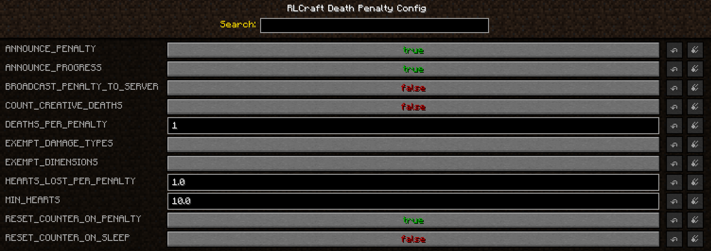

# RLCraft Death Penalty

A Forge 1.12.2 addon that replaces "die once, lose everything" with a health cost you
actually feel — without resorting to `keepInventory`.

Dying takes hearts off your maximum health, permanently, down to a floor you set. Hearts
come back the way they always did: [Scaling Health](https://www.curseforge.com/minecraft/mc-mods/scaling-health)
heart containers. Death stops being a total wipe and becomes a resource you can't farm
your way out of.

Built for **RLCraft Dregora**, but nothing in it is pack-specific — it works on any 1.12.2
pack with Scaling Health.

## Why this instead of the settings that already exist

Scaling Health already has `Health Lost On Death` and `Min Health`. If flat "every death
costs a heart, floor at N" is all you want, **use those and skip this mod entirely.**

What Scaling Health has no concept of is a *grace period*. This mod adds one: die N times
before anything is charged. That turns death from a per-incident tax into a budget, which
is the difference between "I'm scared to leave base" and "I have three mistakes left".

While it's installed, this mod takes over health-on-death completely. It snapshots your
max health before Scaling Health's respawn handler runs and writes the final value after,
so Scaling Health's own `Health Lost On Death` can never double-charge you — leave it at
`0` to avoid confusion, but nothing breaks if you don't.

## Settings

`config/rlcraftdeathpenalty.cfg`, or in-game via Mods → RLCraft Death Penalty → Config.
Everything is in **whole hearts** and read live — no restart needed.



| Setting | Default | What it does |
|---|---|---|
| `HEARTS_LOST_PER_PENALTY` | `1.0` | Hearts removed per penalty. `0.5` for half a heart; `0` to track deaths without charging. |
| `DEATHS_PER_PENALTY` | `1` | Deaths required to trigger one penalty. `3` = two free deaths, then the third bites. |
| `MIN_HEARTS` | `10.0` | The floor. You can never be penalised below this. See below. |
| `RESET_COUNTER_ON_PENALTY` | `true` | Grace period repeats. Set `false` to make it one-time-only. |
| `RESET_COUNTER_ON_SLEEP` | `false` | Sleeping through the night forgives pending deaths. Does **not** refund hearts. |
| `COUNT_CREATIVE_DEATHS` | `false` | Whether creative/spectator deaths count. |
| `ANNOUNCE_PENALTY` | `true` | Tell the player in chat when they're charged. |
| `ANNOUNCE_PROGRESS` | `true` | Tell them how many deaths remain when they aren't. |
| `BROADCAST_PENALTY_TO_SERVER` | `false` | Announce penalties to everyone. |
| `EXEMPT_DIMENSIONS` | *(empty)* | Dimension IDs where dying is free. |
| `EXEMPT_DAMAGE_TYPES` | *(empty)* | Damage types that don't count — `fall`, `lava`, `cactus`, … |

`EXEMPT_DAMAGE_TYPES` matches Minecraft's internal damage name, **not** the death message.
If you don't know a modded one, set the log level to debug — every death this mod sees is
logged with its damage type.

### Why the floor defaults to 10 hearts

Because that's exactly what you start with. Scaling Health's `Starting Health` is 20
half-hearts, so a floor of 10 hearts means **the hearts you were born with can never be
taken away, and only the ones you added with heart containers are ever at stake.**

Two things fall out of that, both intended:

- Dying while you're still learning the pack costs you nothing. New players aren't
  punished for the deaths that are going to happen anyway.
- Every heart container becomes a decision instead of a free upgrade. Using one puts it
  permanently at risk — so the question stops being "can I craft another heart?" and
  becomes "do I trust myself with the next fight enough to bank this now?"

The penalty only has teeth once you've chosen to give it teeth. If you change Scaling
Health's `Starting Health`, change `MIN_HEARTS` to match or the effect is lost.


## Commands

| Command | Permission | |
|---|---|---|
| `/deathpenalty status` | anyone | Your max health, floor, deaths banked, and lifetime totals. |
| `/deathpenalty status <player>` | level 2 | Same, for someone else. |
| `/deathpenalty reset <player>` | level 2 | Clears counters. Does not refund hearts. |
| `/deathpenalty sethearts <player> <hearts>` | level 2 | Sets max health directly — the way to hand hearts back. |

Aliased to `/dp`.

## Pairing it with item loss

This mod deliberately does nothing to your inventory. It's designed to sit alongside a
death-penalty mod that handles items — [Corpse Complex](https://www.curseforge.com/minecraft/mc-mods/corpse-complex)
is already in RLCraft, and its Inventory Module is off by default. Turning it on and
keeping equipped gear (armour, hotbar, hands, baubles, toolbelt) while still dropping your
main inventory gives you the intended shape: **you keep your kit, you drop your loot, and
the hearts are the part that actually hurts.**

## Building

```bash
gradlew build
```

Needs `deps/ScalingHealth-1.12.2-1.3.42.jar` and `deps/SilentLib-1.12.2-3.0.14.jar` —
see [deps/README.md](deps/README.md). Do not raise `forge_version` past `14.23.5.2847`;
see the note in [gradle.properties](gradle.properties).

## Not affiliated

Unofficial addon. Not affiliated with the RLCraft team, Dregora, or Scaling Health.
